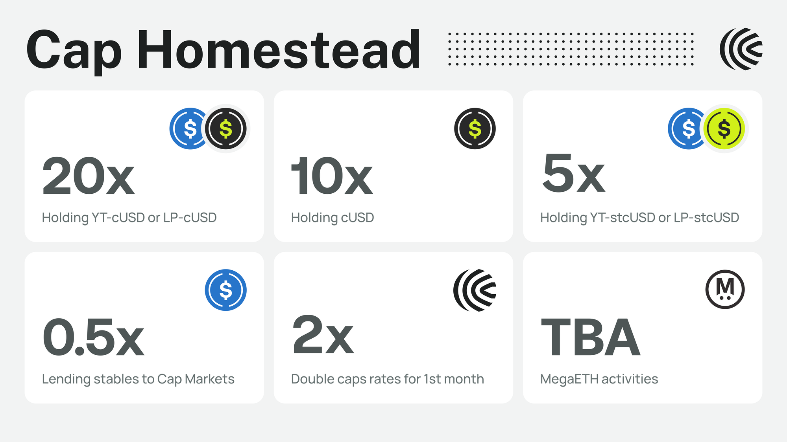

# Homestead Program

With the Homestead program, we’re entering the next phase of the protocol: sustained production.&#x20;

### Homestead timeline

* Start date: January 29th, 2026
* End date: July 23rd, 2026

Within the program, there are two tracks: Caps and Cogs

### Caps&#x20;

<figure><figcaption></figcaption></figure>

USD holders have a choice: yield or Caps. cUSD holders are incentivized to earn Caps. Those who join and remain active from the outset stand to earn the highest number of Caps.&#x20;

Users can accrue Caps by exploring cUSD integrations across DeFi. The leaderboard for Caps can be found [here](https://cap.app/caps).


For the first month of the program, users will earn **Double Caps** for all Homestead activities


#### Holding cUSD

Holding cUSD earns **10x** Caps

#### Pendle

* [YT cUSD / LP cUSD](https://app.pendle.finance/trade/markets/0x307c15f808914df5a5dbe17e5608f84953ffa023/swap?view=yt\&chain=ethereum): Holding YT cUSD or LP cUSD for **20x** Caps
* [YT stcUSD / LP stcUSD](https://app.pendle.finance/trade/markets/0x307c15f808914df5a5dbe17e5608f84953ffa023/swap?view=yt\&chain=ethereum): Holding YT stcUSD or LP stcUSD for **5x** Caps


Pendle markets expire Jul 22 2026&#x20;


#### Lending Markets

Lending stablecoins to stcUSD and Cap PTs  earn **0.5x** Caps per dollar per day

* [Morpho stcUSD / USDC ](https://app.morpho.org/ethereum/market/0xeb17955ea422baeddbfb0b8d8c9086c5be7a9cfdefb292119a102e981a30062e/stcusd-usdc)

#### Further Integrations

Stay tuned for additional campaigns! Please follow [Cap’s community handle](https://x.com/capmoney_) on X for updates.

### Cogs

Delegators on Cap will continue to earn COGs following the Frontier program.

<figure><figcaption></figcaption></figure>

The formula to calculate COGs is the following:

<em>COGs = Delegation Value * Borrow Boost * Delegation Boost</em>

Breaking it down, Delegators earn COGs proportional to the amount delegated.  

The Borrow Boost is calculated as:

<em>Borrow Boost = min (18 * LTV + 1, 10)</em>

In English, the borrow boost is determined based on the current Loan To Value of the delegated Operator. If the Operator's LTV is currently 20%, the boost will be **4.6x**. The minimum boost is **1x** and is capped at **10x.**

Finally, we are introducing the Delegation Boost. Delegations over certain USD amounts will receive a multiplier boost. Specifically, the boost follows a step function at 3 amounts: $25m, $50m, and $100m. For example, a $75M delegation will receive **1.5x** COGs.&#x20;

<figure><figcaption></figcaption></figure>


&#x20;A minimum delegation of $2M is required to earn Cogs

